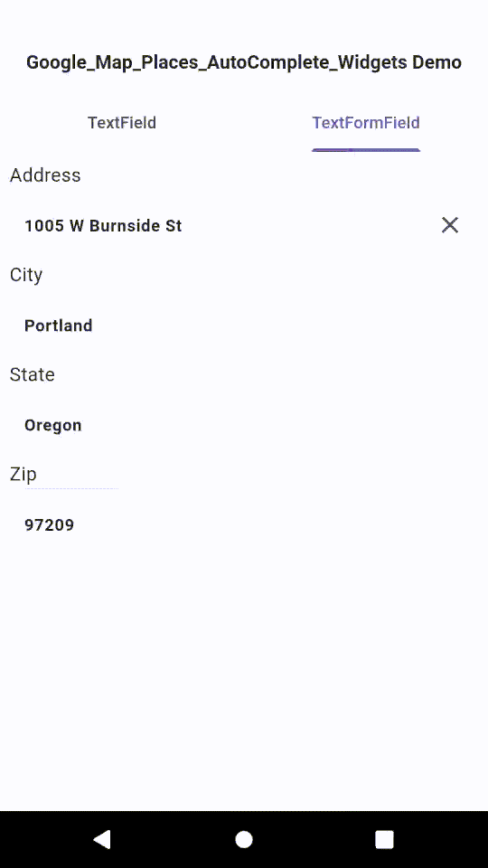

# Google_Maps_Places_Autocomplete_Widgets

Feature complete, 'drop in' replacements for Flutter `TextField` or `TextFormField` widgets, providing address autocompletion using the Google Maps Places API.
The only required additional parameter is your Google Maps API key.
Just rename `TextField` -> `AddressAutocompleteTextField`,
(or `TextFormField` -> `AddressAutocompleteTextFormField`),
and add your `mapsApiKey:'YOUR_GOOGLE_MAPS_API_KEY'` as the only required additional parameter.

If desired customize any look/behavior of the autocompletion using the additional optional parameters.

Additionaly Postal code/Zip code autocompletion is supported using the `postalCodeLookup:true` parameter.

Easily incorporated into existing forms which contain mulitple fields for capturing address information.

## Demo



## Features

- Support for most common `TextField` and `TextFormField` parameters (and any
  less common parameter can easily be added).
- Support for both address and postal/zip code autocompletion.
- Robust set of optional callbacks that all customizing behavior in virtually any way.
- Easy 'drop in' replacement of address field in any flutter form.
- Easy customizition of virtually every look and feel display/behavior property.
- Hooks allow filling mutiple form fields (City, State, Zip, etc.) from results
  of user's address selection from the initial address form field autocomplete
  suggestions.
- Hooks to allow clearing of multiple other form fields when the clear button
  is used in the address autocomplete widget.
- Ability to customize the search query string with contents of other form fields
  before querying google maps places api.
- Ability to use the contents of the autocomplete suggestion without additional
  google maps places details api request.
- The base classes and mixin generics provided in this package allow for the addition
  of address autocompletion to virtually any of custom widgets.

## Usage

You can find a complete example of usage in `example/main.dart`.

import the package:

```dart
import 'package:google_maps_places_autocomplete_widgets/address_autocomplete_widgets.dart';
```

Add your google places api key, optional `onSuggestionClick` callback,
and optional language and country restrictions parameters:

```dart
AddressAutocompleteTextField(
    mapsApiKey: 'YOUR GOOGLE MAPS API KEY HERE',
    onSuggestionClick: onSuggestionClick,
    componentCountry: 'us',
    language: 'en-US'

    //..any other arguments that you would use with a TextField..

),
```

or

```dart
AddressAutocompleteTextFormField(
    mapsApiKey: 'YOUR GOOGLE MAPS API KEY HERE',
    onSuggestionClick: onSuggestionClick,
    componentCountry: 'us',
    language: 'en-US'

    //..any other arguments that you would use with a TextFormField..
),


```

To utilize any of the robust set of retrieved `Place` details write a
`onSuggestionClick` callback function:

```dart
void onSuggestionClick(Place placeDetails) {
    setState(() {
      // examples of the returned address details
      _name = placeDetails.name;
      _formattedAddress = placeDetails.formattedAddress;
      _formattedAddressZipPlus4 = placeDetails.formattedAddressZipPlus4;
      _streetAddress = placeDetails.streetAddress;
      _streetNumber = placeDetails.streetNumber;
      _street = placeDetails.street;
      _streetShort = placeDetails.streetShort;
      _city = placeDetails.city;
      _county = placeDetails.county;
      _state = placeDetails.state;
      _stateShort = placeDetails.stateShort;
      _zipCode = placeDetails.zipCode;
      _zipCodeSuffix = placeDetails.zipCodeSuffix;
      _zipCodePlus4 = placeDetails.zipCodePlus4;
      _country = placeDetails.country;
      _vicinity = placeDetails.vicinity;
      _lat = placeDetails.lat;
      _lng = placeDetails.lng;
    });
  }
```

## More complex use and customization examples

A complete example mobile/desktop applications illustrates the use of both common
and optional parameters.
This includes the use of the address autocomplete TextFormField widget to fill
multiple other TextFormFields from the user's selected address suggestion.

## Additional information

This package implements the oficial documention of Google Maps Places API
and use address as types and receive a detail with address_component and geometry as fields only

GitHub Repo: [https://github.com/timmaffett/google_maps_places_autocomplete_widgets]( https://github.com/timmaffett/google_maps_places_autocomplete_widgets)

## Acknowledgements

This package was originally based on source code from the package
`maps_places_autocomplete 0.0.2` by @leandro-zanardi.  As I customized my use case
within my own apps the source code diverged significantly from the original package
and it was easiest for me to create my own new package.

The rather unfortunate (and long) name for this package is a result of the
pub.dev namespace clutter of various packages also using Google Maps Places API.
